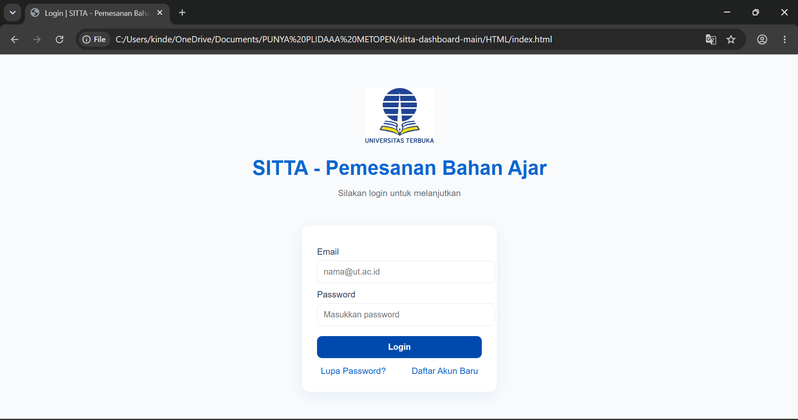
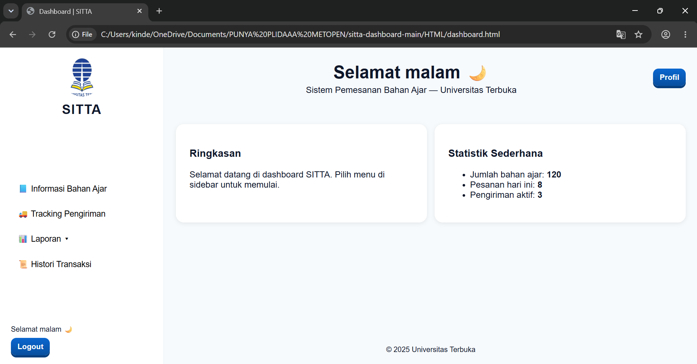
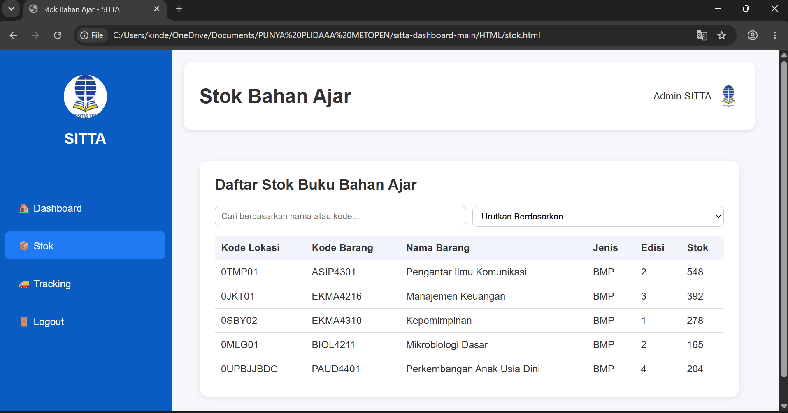
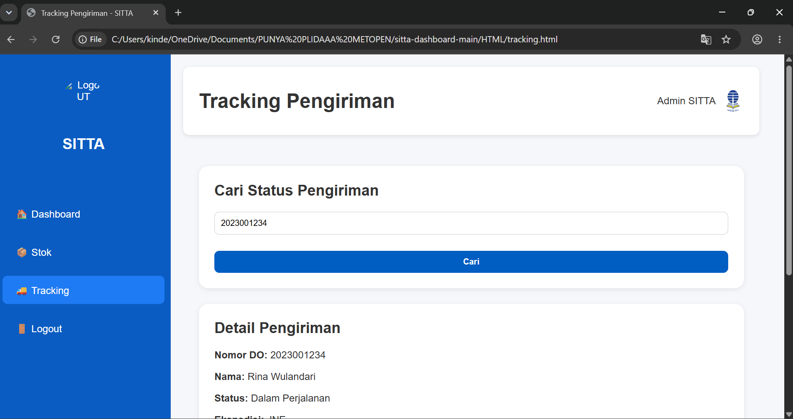

# 📊 SITTA Dashboard

A simple web dashboard developed using **HTML, CSS, and JavaScript** to display learning material inventory and delivery tracking information.

This project was created to practice the fundamentals of web development, including page layout, navigation, and responsive interface design.

---

## 📸 Preview

### Login Page



### Dashboard



### Inventory



### Tracking


---

## ✨ Features

* 📈 Dashboard overview
* 📦 Inventory page
* 🚚 Delivery tracking page
* 🏠 Landing page
* Responsive web layout
* Simple navigation between pages

---

## 🛠 Tech Stack

| Technology | Purpose             |
| ---------- | ------------------- |
| HTML5      | Page Structure      |
| CSS3       | Styling             |
| JavaScript | Basic Interactivity |

---

## 📂 Project Structure

```text
sitta-dashboard/
│
├── index.html
├── dashboard.html
├── stok.html
├── tracking.html
└── README.md
```

---

## 🚀 Getting Started

Clone the repository.

```bash
git clone https://github.com/Plida05/TUGAS-1-SITTA-PBW.git
```

Open the project folder and launch `index.html` using your preferred web browser.

No additional dependencies or installation are required.

---

## 🎯 Learning Objectives

This project was developed to practice:

* HTML5 Fundamentals
* CSS3 Layout & Styling
* JavaScript Basics
* Multi-Page Website Development
* Responsive Web Design

---

## 👩‍💻 Author

**Rr Nabila Fatharani Yuwvrida**

Information Systems Student
